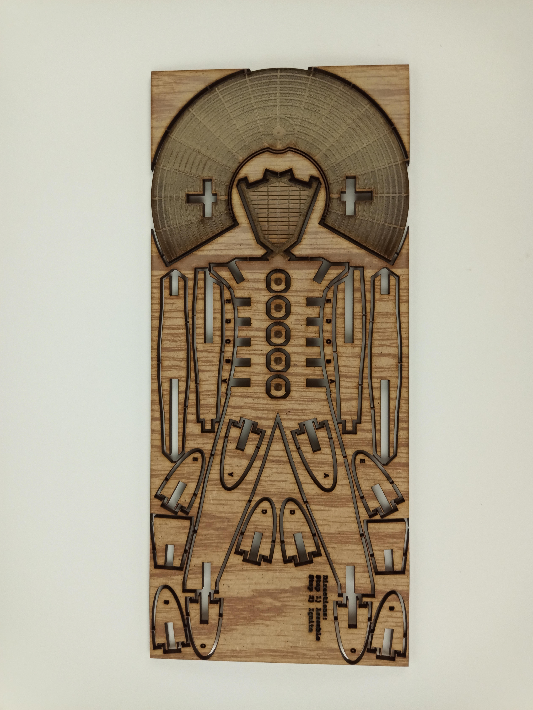

# BurnableMan

A laser-cuttable mini man figure intended to be burned.

1/8" plywood or similar material.

Conveniently fits in a #10 envelope.

Curf of cutter will affect how well he holds together.  Get creative if too lose.

- Layers on the DXF:
- Green - COnstruction - don't cut
- Red - Outer relief - cut all the way through
- Magenta - Main man cut lines - cut all the way through
- Dark Blue - directions, mostly useless.  Etch (light cut, not all the way through) or don't, I don't care.
- Yellow - Outer perimeter - cut all the way through - cut last
- Light blue / Cyan - Decoration - Scan etch (light etch scan over enclosed areas).

[Licesnsed under the WTFPL](http://www.wtfpl.net/about/)

